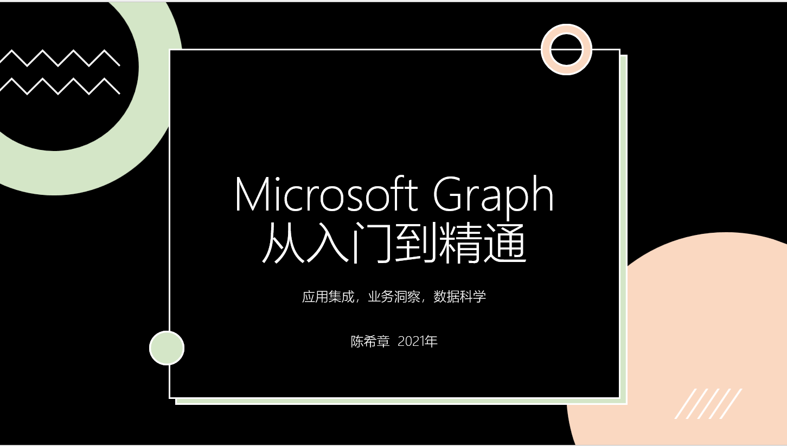

# Microsoft Graph 从入门到精通
> 作者：陈希章 <ares@xizhang.com>

## 概述

今年的早些时候，我写完了第二本书《[Microsoft Teams 平台完全手册](https://teamsplatform.xizhang.com)》，但正应了那句话：忙好这一阵子，就可以忙下一阵子了。在经过一段时间的休整后，我准备在农历年底前完成另外一个小目标，就是这本《Microsoft Graph 从入门到精通》。

我研究 **Microsoft Graph** 好些年了，最开始只是好奇，因为原先的 Office 365 的很多API，逐渐统一到 Microsoft Graph 这个集中的平台上来。后来，因为工作需要，不仅仅是我们自己内部研发产品会用到它，同时我也参与了一些跟客户或合作伙伴的项目，他们也大量地使用到了 Microsoft Graph。

另外，大家都知道在现在的时代，数据意味着很多。Microsoft Graph 对外虽然是一个很简单的接口（API），但其真正的价值是后台的大量数据，以及利用这些数据可以进行的深入分析所产生的洞察。这些数据是每个客户（或用户）自己掌握的，而且都是高质量的数据集，现在又有很多数据科学的技术，甚至机器学习、深度学习的成功经验，微软作为平台已经基于这些数据（及其模型）构建了很多有意思的智能化应用，但其实我们的客户、合作伙伴也都可以进一步掌握它。

最后，作为一个软件从业者，职业上的习惯促使我进一步思考的是，Microsoft Graph 是怎么打造出来的？如果是客户、合作伙伴自己的平台，也想提供类似的服务，那么大致是需要怎么去规划、设计和运营呢？

带着这些实践经验，以及更多的是困惑和思考，我开始了这个新的系列文章和视频的创作。写这个系列，是对多年工作的梳理，也希望对大家会有所帮助吧。

## 内容

这个系列也将在内容上有所创新，首先将包含电子书的部分，这是完全免费的，你将通过 <https://graph.xizhang.com> 永久访问到，另外我也会录制一些配套视频内容，将发布到网易云课堂上，那个部分会收取少量的费用，大家可以按需使用。

这个系列初步计划将包含如下的内容，将视情况还可能会有所增删：

| 部分      | 章节 |
| ----------- | ----------- |
| 基础部分||
||Microsoft Graph 设计的起源和基本框架|
||准备学习和开发环境|
||通过Microsoft Graph Explorer 和 Postman 学习Microsoft Graph|
||应用注册，授权，基本调用|
||原理初探：Metadata 和 OAuth,REST vs Graphql|
||国际版和中国版|
| 进阶部分   ||
||桌面应用开发集成|
||Web应用开发集成|  
||Python应用开发集成|
||PowerShell 开发集成|
||Microsoft Teams 开发人员专题|
| 高级部分   ||
||单点登录解决方案|
||高级使用：批量，流量控制，增量，订阅更新，分页，排序等|  
||扩展Microsoft Graph（扩展，连接器）|
||数据科学家：使用Microsoft Graph data connect 进行数据建模分析|
|特别课程||
||教育行业应用场景和开发|
||面向财务的应用开发|
||Excel as a Service|

**千里之行始于足下，但行好事莫问前程**，与诸君共勉！

陈希章 

于上海某个陪娃上课的角落

2021-12-11