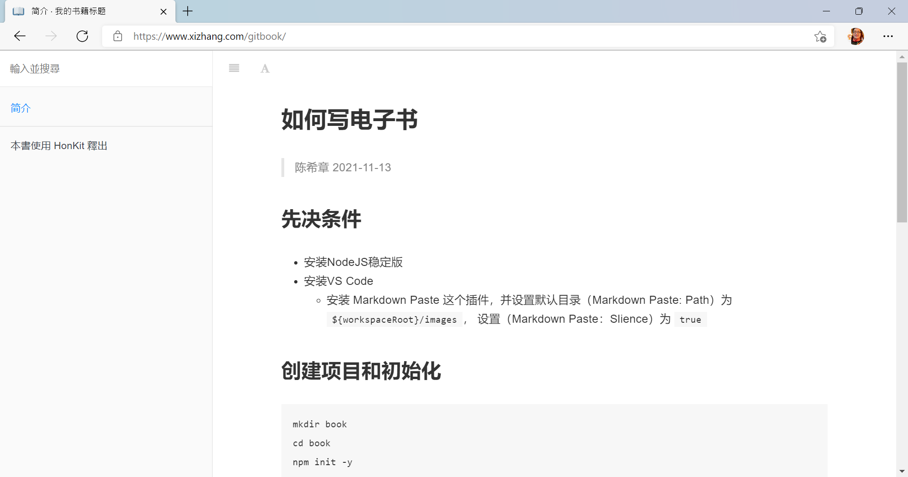

# 如何写电子书
> 陈希章 2021-11-13

## 先决条件
- 安装NodeJS稳定版
- 安装VS Code
    - 安装 Markdown Paste 这个插件，并设置默认目录（Markdown Paste: Path）为 `${workspaceRoot}/images`， 设置（Markdown Paste：Slience）为 `true`

## 创建项目和初始化

```
mkdir book
cd book
npm init -y
npm install honkit --save-dev
npx honkit init
git init
code .
```

创建 .gitignore文件，内容如下

```
node_modules
_book
```

创建book.json文件，内容如下
```
{
    "title": "我的书籍标题",
    "author": "作者名称",
    "description": "书籍的描述信息，可用于SEO",
    "language": "zh"
}
```
## 撰写书籍

- SUMMARY.md 定义目录
- 其他就是按照需求编写markdown文件即可，建议不同章节用文件夹分开
- 图片粘贴，请用 CTRL+ALT+V 即可，会自动在根目录下面的images目录

## 发布到Github pages

- 创建一个public的仓库
- 在 <https://github.com/settings/tokens> 创建一个token，要选中 `repo` 这个权限，设置不要过期，并且复制好这个token
- 在你刚创建的仓库中，导航到 <你的仓库地址/settings/secrets/actions>，定义这个token作为密钥，命名为 `GITBOOK`
- 创建远程仓库链接 `git remote add origin 你的仓库地址`
- 提交更新到Github `git add .`, 然后 `git commit -m '初始化'`, 最后 `git push origin master`
- 创建一个Github Action，内容如下
    ```
    # This is a basic workflow to help you get started with Actions

    name: publish gitbook to pages

    # Controls when the workflow will run
    on:
      # Triggers the workflow on push or pull request events but only for the master branch
      push:
        branches: [ master ]
      pull_request:
        branches: [ master ]

      # Allows you to run this workflow manually from the Actions tab
      workflow_dispatch:

    # A workflow run is made up of one or more jobs that can run sequentially or in parallel
    jobs:
      # This workflow contains a single job called "build"
      build:
        # The type of runner that the job will run on
        runs-on: ubuntu-latest

        # Steps represent a sequence of tasks that will be executed as part of the job
        steps:
          # Checks-out your repository under $GITHUB_WORKSPACE, so your job can access it
          - uses: actions/checkout@v2

          # Runs a single command using the runners shell
          - name: Install & Build
            run: |
              npm install
              npm run build
          - name: Deploy
            uses: peaceiris/actions-gh-pages@v3
            with:
              github_token: ${{ secrets.GITBOOK }}
              publish_dir: ./_book
    ```
    
- 保存这个Action后，它会先自动运行一次，你稍后就可以在 <你的仓库地址/settings/pages> 查看所生成的Github pages网站信息了。例如当前这个模板网站，运行效果如下

    

- 到这里为止，我们就完整地了解了如何编写电子书并且持续发布的流程了，更多细节还可以参考 <https://honkit.netlify.app/>
