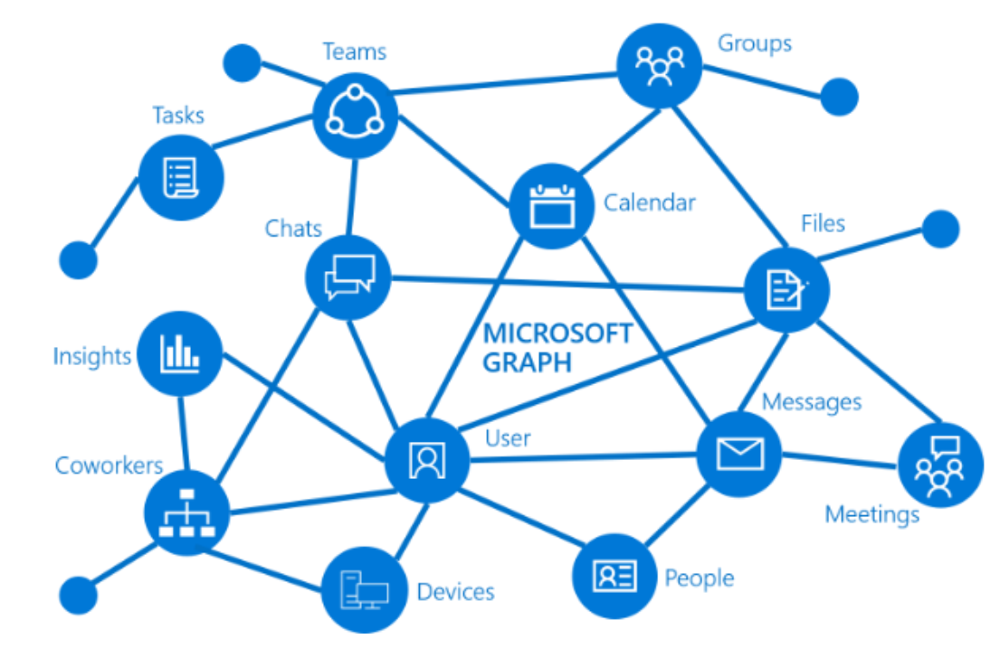

# Microsoft Graph 从入门到精通

作者：陈希章

永久访问地址 https://graph.xizhang.com

## 概述
<!--
footer: Microsoft Graph 从入门到精通，作者：陈希章, 官网：https://graph.xizhang.com
-->
<!--第一页的备注文字-->

创作这个系列的动机，是希望总结分享几个方面的知识

1. 理解Microsoft Graph 如何在应用开发中的价值
1. 学习Microsoft Graph 在数据科学中的应用及其前景
1. 了解Microsoft Graph 如何构建出来

## 内容
<!--第二页的备注文字-->

这个课程既有文字版，也有视频教程。文字版（演讲稿带备注）请通过 https://graph.xizhang.com 访问，永久免费。视频教程将发布到网易云课堂上面，适当收费，请大家按需取用。

本系列讲座内容分为：基础部分，进阶部分，高级部分，特殊课程等四个部分。

### 基本部分

1. [Microsoft Graph 设计的起源和基本框架](basic/overview_and_framework.md)
1. 准备学习和开发环境
1. 通过Microsoft Graph Explorer 和 Postman 学习Microsoft Graph
1. 应用注册，授权，基本调用
1. 原理初探：Metadata 和 OAuth,REST vs Graphql
1. 国际版和中国版

### 进阶部分

1. 桌面应用开发集成
1. Web应用开发集成  
1. Python应用开发集成
1. PowerShell 开发集成
1. Microsoft Teams 开发人员专题

### 高级部分

1. 单点登录解决方案
1. 高级使用：批量，流量控制，增量，订阅更新，分页，排序等  
1. 扩展Microsoft Graph（扩展，连接器）
1. 数据科学家：使用Microsoft Graph data connect 进行数据建模分析

### 特别课程

1. 教育行业应用场景和开发
1. 面向财务的应用开发
1. Excel as a Service

## 相关资源

申请开发者账号：https://developer.microsoft.com/zh-CN/office/dev-program

## 与诸君共勉！

**千里之行始于足下，但行好事莫问前程**

:satisfied::smiley::heart::grin::kissing_heart:

陈希章 于上海某个陪娃上课的角落

2021-12-11

